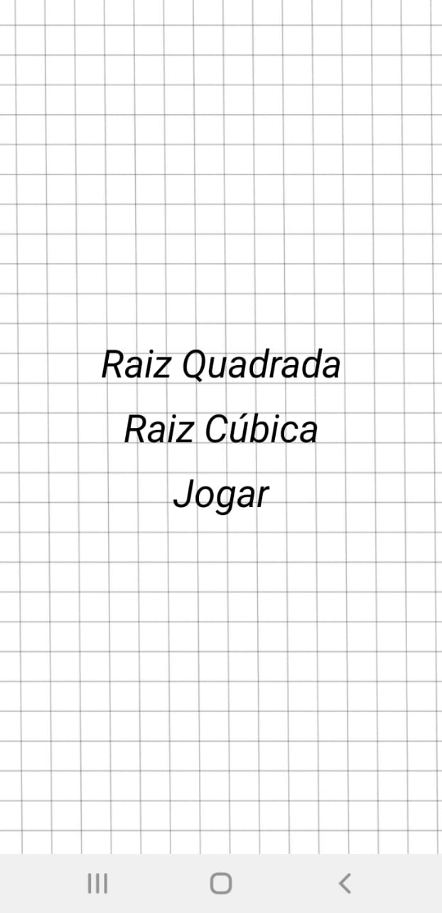
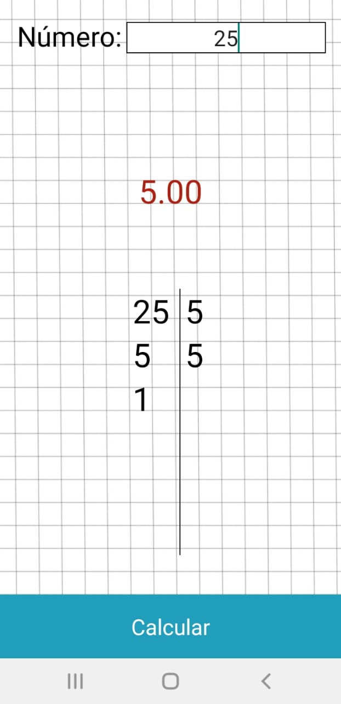
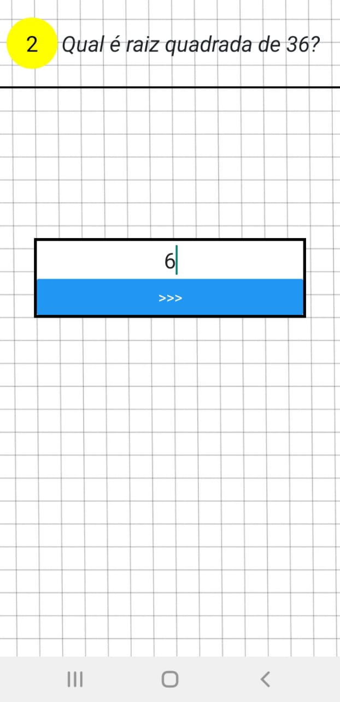

# square-root-calculator
made with react native and expo.

## Home page

<ul>
<li>Raiz quadrada: this is gonna calculate the square root</li>
<li>Raiz cúbica: this is gonna calculate the cube root</li>
<li>Jogar: little game to practice the square root calculation</li>
</ul>

## Calculator

## Game

